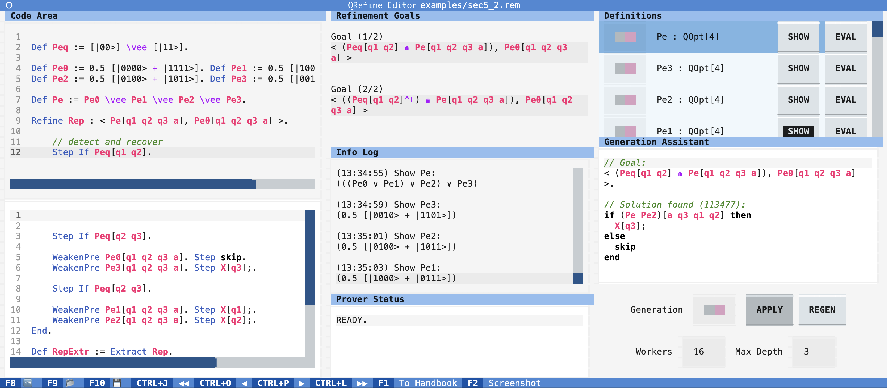

# Rem


YouTube Tutorial: https://www.youtube.com/watch?v=cFOUQpx2vx0

`Rem` is a langauge and the software implementation for quantum program refinement.
It aims to help by automation in the development procedure, and highlights in program synthesis. 
`Rem` performs common work like parsing, checking of well-formedness and computing the classical simulation. 
It also verifies adherence to specified prescriptions and aids in the refinement of programs in the sense of projection based partial correctness, and generate correct programs for simple prescriptions. 

## Language
The design of `rem` resembles common theorem provers like `Coq`. It has an environment to maintain the definitions of operators and programs, and use commands to operate the refinement and output. The langauge for operators include predefined constants (such as $X$, $Y$ and $Z$ gates) and operations (such as multiplication and Sasaki conjunction). Indices of quantum registers and automated cylinder extension of indexed operators are supported.

## Implementation
The software is implemented in Python as a terminal program, with a beautiful graphic user interface powered by `textual` package. 
Besides, we use `ply` for parsing and `NumPy` for numerical calculations. As mentioned before, we adhere to variable-free operator expressions so that they can be converted into matrices for calculations. The editor window is divided into the coding area, the display of refinement goals, the list of existing definitions and the panel to control program generation (synthesis).

## Installation
Tested on MacOS and Linux. Language syntax highlight is disabled for Windows for now.

To install, create a virtual environment of Python 3.11, for example:
```
conda create -n rem python=3.11
conda activate rem
```
Then clone the repository, navigate to its root folder and run
```
pip install -r requirements.txt
```
It will install all the dependent packages. Afterwards, boot the software by running
```
python boot.py
```


## User Interface
`Rem` is a terminal program with a graphic user interface. The interface of the editor is divided into several areas:

- **Code Area**: the code area is separated into two parts. The top half contains the code executed by `Rem`, and the bottom half is the input area for subsequent codes. Click and select the processed command, and other areas will display the information at that frame.

- **Refinement Goals**: when `Rem` enters refinement mode, the goals of program prescriptions to fulfill will be displayed here.

- **Info Log**: a logging of operations and information output.

- **Prover Status**: the status of the prover. It can be either `READY`, `Calcualting`, or in some error state.

- **Definitions**: the definitions in the environment of the current frame. The switch of each item controls whether it is included in the searching of program synthesising. The bottom `SHOW` and `EVAL` will display the corresponding information in the log.

- **Generation Assistant**: the generation assistant panel. During refinement mode, the assistant will actively search for the correct program synthesising results for the first refinement goal.
  - *Generation* switch: controls whether automated generation is turned on.
  - *APPLY* button: apply the generation result when available.
  - *REGEN* button: regenerate the result.
  - *Workers* input: the number of processes for the generation.
  - *Max Depth* intput: the maximum syntax tree depth for the generated result. 

The buttons at the footer are:
- **New File**(`F8`): start a new code file.
- **Open File**(`F9`): open an existing code file.
- **Save File**(`F10`): save the file.
- **Play Backward**(`Ctrl+j`): revert the execution of all commands.
- **Step Backward**(`Ctrl+o`): revert one step of command execution.
- **Step Forward**(`Ctrl+p`): execute one command in the input area.
- **Play Forward**(`Ctrl+l`): execute all the commands in the input area in a sequence.
- **To Handbook**(`F1`): go to the handbook of `Rem`.
- **Screenshot**(`F2`): take a screenshot of the current window.

## Documentation
This section explains the language and commands of `Rem`.

### Variables
Variables in `Rem` are identifiers following the regular expression 
`[a-zA-Z\'][a-zA-Z\'0-9]*`.

### Quantum Registers
In `Rem`, the whole quantum system consists of qubits, and every qubit is denoted by an identifier. A quantum register is an ordered list of unique qubit identifiers. For example, valid quantum registers include:
- `[]`, `[p]`, `[p q r']`, ...
  
And invalid quantum registers include:
- `[p p]`, `[1p 2q]`, ...

### Types
There are three data types in `Rem`: 
- `IQOpt`: indexed quantum operators.
- `QOpt[n]`: n-qubit quantum operators. 
- `QProg`: quantum programs.


### Terms
The terms can be constructed in the following syntax:
- `term := var`: a variable is a term
- `term := ( term )`
- `term := Import path`: import a `numpy` .npy file as an operator
- `term := term qvar`: an `IQOpt` term can be constructed from an `QOpt` term and a quantum variable list
- `term := - term`
- `term := term + term`
- `term := term - term`
- `term := num * term` (or `term := num term`)
- `term := term * term`
- `term := term^\dagger`
- `term := term \otimes term`
- `term := term \vee term`
- `term := term \wedge term`
- `term := term ^\perp term`
- `term := term \SasakiImply term`
- `term := term \SasakiConjunct term`
- `term := [ qvec ]`: A projector on the vector. The grammar for vectors are defined as follows:
    - `qvec := BITSTR` BITSTR represent the bit string for the base.
    - `qvec := qvec + qvec`
    - `qvec := num '*' qvec` (or `qvec := num term`)
- `term := [[ prog ]](term)`: a term can be the classical simulation result of the quantum program with the initial state
- `term := prog`: a term can be a quantum program.

### Programs
The language for quantum programs are as follows.
- `prog := var`
- `prog := abort`: abort program
- `prog := skip`: skip program
- `prog := qvar:=0`: quantum register initialization
- `prog := term; `: unitary transformation
- `prog := assert term `: assert program
- `prog := < term , term >`: program prescription, with the first term being the precondition and the second being the postcondition
- `prog := { prog [\oplus num] prog } `: probabilistic programs
- `prog := if term then prog else prog end`: if statement
- `prog := while term do prog end`: while statement
- `prog := prog prog`: sequential composition
- `prog := Extract prog`: the program extracted from a refinement result

### Commands
`Rem` use a command language to operate the environment and refinement procedure. The command syntax is defined as follows.

- `Var var : type`: declaring the type for a variable.
- `Def var := term .`: make a definition.
- `Refine var : < term , term >.`: enter the refinement mode.
- `Step prog .`: try to refine the goal with a specific program.
- `Step Seq term .`: refine the goal with sequantial composition.
- `Step If term .`: refine the goal with if statement.
- `Step While term Inv term .`: refine the goal with while statment, with invariant specified.
- `WeakenPre term .`: try to weaken the precondition.
- `StrengthenPost term .`: try to strengthen the postcondition.
- `Choose num.`: choose another refinement goal.
- `End.`: end the refinement when all alls are clear.
- `Show var.`: display the definition.
- `Eval term.`: evaluate the definition.
- `Test term = term.`: test whether two operators are equivalent.
- `Test term <= temr.`: test whether the two projects satisfy the implication relation.
